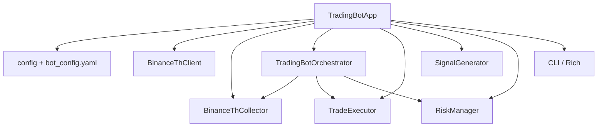
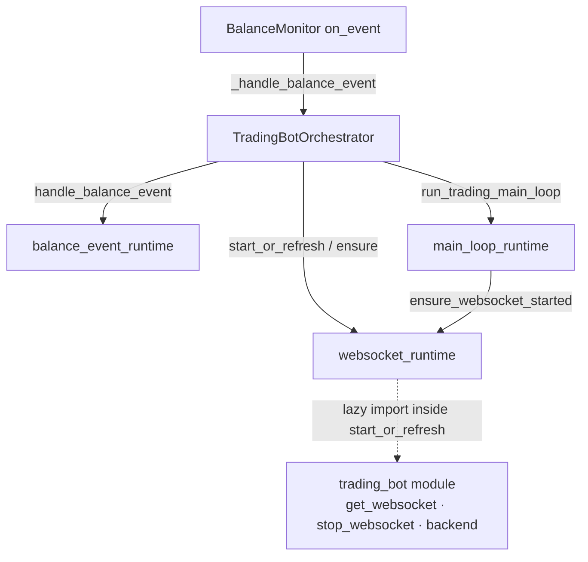
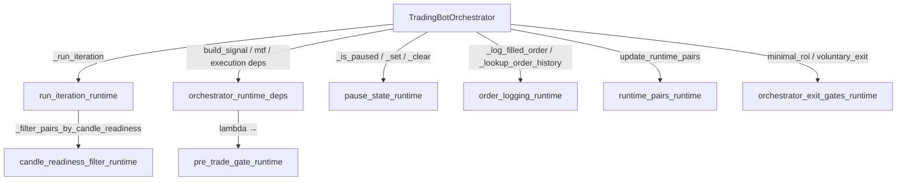

# ADR-001: Domain boundaries and dependency map (Binance Thailand runtime)

**Status:** Accepted (living document; update as refactor PRs land)

**See also:** [Documentation index (`docs/README.md`)](README.md) — ดัชนีคู่มือทั้งโปรเจกต์และลิงก์ไปโมดูลอื่น

## Context

The bot is a terminal-first runtime: `TradingBotApp` wires configuration, data collection, orchestration, execution, persistence, and observability. Refactors should preserve `bot_config.yaml` semantics and public entrypoints (`main.py`, `run_bot.bat`).

## Domain map (conceptual)

| Domain | Primary modules | Depends on |
|--------|-----------------|------------|
| Config / bootstrap | [`config.py`](../config.py), [`project_paths.py`](../project_paths.py) | env, YAML |
| Exchange boundary | [`api_client.py`](../api_client.py) (`BinanceThClient`) | HTTP, HMAC signing, circuit breaker |
| Data / candles | [`data_collector.py`](../data_collector.py) | api_client, SQLite |
| Orchestration | [`trading_bot.py`](../trading_bot.py) (`TradingBotOrchestrator` facade), [`trading/bot_runtime/`](../trading/bot_runtime/) (orchestrator slices), other [`trading/*`](../trading/) helpers | signals, executor, risk, monitoring |
| OMS / execution | [`trade_executor.py`](../trade_executor.py), [`state_management.py`](../state_management.py) | api_client, database |
| Strategy / signals | [`signal_generator.py`](../signal_generator.py), [`strategies/`](../strategies/) | indicators, configs |
| Risk | [`risk_management.py`](../risk_management.py), [`plugins/protections/`](../plugins/protections/) | portfolio snapshots |
| Persistence | [`database.py`](../database.py) | SQLAlchemy / SQLite WAL |
| Observability | [`alerts.py`](../alerts.py), [`telegram_bot.py`](../telegram_bot.py), [`monitoring.py`](../monitoring.py), [`cli_ui.py`](../cli_ui.py) | snapshots from app |

## TradingBotApp (`main.py`) dependency sketch

`TradingBotApp` must not create circular imports: orchestrator and executor are constructed during `initialize()`; collectors start before the trading loop.

## BinanceThClient contract (surface used by runtime)

Consumers: `TradeExecutor`, `BinanceThCollector`, CLI price helpers, balance/reconcile paths.

**Read:** `get_ticker`, `get_tickers_batch`, `get_candle`, `get_symbols`, `get_balance` / `get_balances`, `get_open_orders`, `get_order_info`, `get_order_history`, `sync_clock`, `check_clock_sync`, `circuit_breaker` state.

**Write:** `place_bid`, `place_ask`, `cancel_order`.

**Operational:** `_request` (signed/unsigned), `reset_circuit`, symbol normalization `_to_binance_symbol`.

**Out of scope for thin refactors:** The large [`exchange/`](../exchange/) tree (upstream-style); changes there are separate from `BinanceThClient` facade work.

## Refactor rules (cross-domain PRs)

1. One behavioural domain per PR; keep migrations and formatting in separate commits when possible.
2. Prefer new submodules under [`trading/`](../trading/) (e.g. [`order_history_utils.py`](../trading/order_history_utils.py)), [`cli_snapshot_build.py`](../cli_snapshot_build.py) for CLI DTO assembly, [`state_facade.py`](../state_facade.py) for lifecycle reads, [`signal_pipeline.py`](../signal_pipeline.py) for signal collection stages,
[`trading/candle_retention.py`](../trading/candle_retention.py),
[`trading/db_maintenance.py`](../trading/db_maintenance.py),
[`trading/mtf_readiness.py`](../trading/mtf_readiness.py),
[`trading/position_bootstrap.py`](../trading/position_bootstrap.py) (balance reconcile + bootstrap context),
[`trading/bot_runtime/balance_event_runtime.py`](../trading/bot_runtime/balance_event_runtime.py),
[`trading/bot_runtime/websocket_runtime.py`](../trading/bot_runtime/websocket_runtime.py),
[`trading/bot_runtime/main_loop_runtime.py`](../trading/bot_runtime/main_loop_runtime.py),
[`trading/bot_runtime/pause_state_runtime.py`](../trading/bot_runtime/pause_state_runtime.py),
[`trading/bot_runtime/orchestrator_runtime_deps.py`](../trading/bot_runtime/orchestrator_runtime_deps.py),
[`trading/bot_runtime/pre_trade_gate_runtime.py`](../trading/bot_runtime/pre_trade_gate_runtime.py),
[`trading/bot_runtime/order_logging_runtime.py`](../trading/bot_runtime/order_logging_runtime.py),
[`trading/bot_runtime/run_iteration_runtime.py`](../trading/bot_runtime/run_iteration_runtime.py),
[`trading/bot_runtime/candle_readiness_filter_runtime.py`](../trading/bot_runtime/candle_readiness_filter_runtime.py),
[`trading/bot_runtime/runtime_pairs_runtime.py`](../trading/bot_runtime/runtime_pairs_runtime.py),
[`trading/bot_runtime/orchestrator_exit_gates_runtime.py`](../trading/bot_runtime/orchestrator_exit_gates_runtime.py),
[`observability/`](../observability/) for alert entrypoints, rather than growing `main.py` / `trading_bot.py`.
3. Tests: `pytest tests` gate; add targeted tests under `tests/` for moved logic.

## Orchestrator runtime slices (`trading/bot_runtime/*`)

These modules hold behaviour that previously lived only on `TradingBotOrchestrator`; the class keeps thin delegates so tests can still call `bot._handle_balance_event`, `TradingBotOrchestrator._main_loop(bot)`, and `_start_or_refresh_websocket` / `_ensure_websocket_started` on the instance.

| Module | Responsibility | Notes |
|--------|----------------|-------|
| [`trading/bot_runtime/balance_event_runtime.py`](../trading/bot_runtime/balance_event_runtime.py) | Balance monitor callback: invalidate portfolio cache, reconcile, deposit messaging, quote-asset pause reasons | Depends on `balance_monitor.BalanceEvent`; uses `trading.coercion.coerce_trade_float`. |
| [`trading/bot_runtime/websocket_runtime.py`](../trading/bot_runtime/websocket_runtime.py) | Start / refresh WebSocket client; retry `ensure` when disconnected | Calls `import trading_bot` **inside** `start_or_refresh_websocket` to read `get_websocket` and `_WEBSOCKET_BACKEND` without an import-time cycle (orchestrator imports this module at top level). |
| [`trading/bot_runtime/main_loop_runtime.py`](../trading/bot_runtime/main_loop_runtime.py) | `while bot.running`: ensure WS, retention / DB hooks, `_run_iteration`, fatal auth handling, sleep | Imports `ensure_websocket_started` from sibling `websocket_runtime`; uses `BinanceAuthException` + alert formatting from `api_client` / `alerts`. |
| [`trading/bot_runtime/pause_state_runtime.py`](../trading/bot_runtime/pause_state_runtime.py) | Manual pause map + monitoring reconciler pause | `is_paused` / `set_pause_reason` / `clear_pause_reason` take `bot` as first arg. |
| [`trading/bot_runtime/orchestrator_runtime_deps.py`](../trading/bot_runtime/orchestrator_runtime_deps.py) | Build `SignalRuntimeDeps`, `MultiTimeframeRuntimeDeps`, `ExecutionPlanDeps`, `ExecutionRuntimeDeps` | Centralises wiring; `ExecutionRuntimeDeps.pre_trade_gate_check` delegates to `pre_trade_gate_runtime`. |
| [`trading/bot_runtime/pre_trade_gate_runtime.py`](../trading/bot_runtime/pre_trade_gate_runtime.py) | `check_pre_trade_gate(bot, decision, portfolio)` — ticker fetch + `PreTradeGate.check_all` | Used from deps builder and mirrored by `_check_pre_trade_gate` on the orchestrator for tests/extension. |
| [`trading/bot_runtime/order_logging_runtime.py`](../trading/bot_runtime/order_logging_runtime.py) | `lookup_order_history_status`, `log_filled_order` persistence | Uses `order_history_window_limit`; no import of `trading_bot`. |
| [`trading/bot_runtime/run_iteration_runtime.py`](../trading/bot_runtime/run_iteration_runtime.py) | Single-loop body: degraded mode, circuit, clock, reconcile, pause, kill-switch, SL/TP, pairs, `_process_pair_iteration` | Depends on orchestrator methods; keeps iteration flow out of `trading_bot.py`. |
| [`trading/bot_runtime/candle_readiness_filter_runtime.py`](../trading/bot_runtime/candle_readiness_filter_runtime.py) | `filter_pairs_by_candle_readiness` — MTF readiness + optional `_warm_pairs_backfill` | Called from `run_iteration` via `_filter_pairs_by_candle_readiness`. |
| [`trading/bot_runtime/runtime_pairs_runtime.py`](../trading/bot_runtime/runtime_pairs_runtime.py) | `update_runtime_pairs` — normalize list, YAML sync, WS refresh/stop | Lazy `import trading_bot` for `stop_websocket` when clearing pairs. |
| [`trading/bot_runtime/orchestrator_exit_gates_runtime.py`](../trading/bot_runtime/orchestrator_exit_gates_runtime.py) | `coerce_opened_at`, `minimal_roi_exit_signal`, `should_allow_voluntary_exit` | Used by `_minimal_roi_exit_signal` / `_should_allow_voluntary_exit` / static `_coerce_opened_at`. |

### Package layout (`trading/bot_runtime/`)

เมื่อเพิ่ม slice ใหม่ให้เก็บไว้ภายในแพ็กเกจนี้ และ wire ผ่านเมธอดบางสายบน `TradingBotOrchestrator` เพื่อไม่ให้เทสเดิมขาดการ bind `TradingBotOrchestrator._method(bot)`.

เรียงตามชื่อไฟล์:

- `__init__.py` — docstring package (ไม่ re-export เชิง eager)
- `balance_event_runtime.py`
- `candle_readiness_filter_runtime.py`
- `main_loop_runtime.py`
- `order_logging_runtime.py`
- `orchestrator_exit_gates_runtime.py`
- `orchestrator_runtime_deps.py`
- `pause_state_runtime.py`
- `pre_trade_gate_runtime.py`
- `runtime_pairs_runtime.py`
- `run_iteration_runtime.py`
- `websocket_runtime.py`

## Phase 8 (optional): `exchange/` fork

The [`exchange/`](../exchange/) tree is upstream-style and **out of scope** for routine domain refactors. Narrow, surgical changes are acceptable when they unblock `api_client.BinanceThClient`; moving or vendoring the subtree is a separate migration with its own compatibility review.
